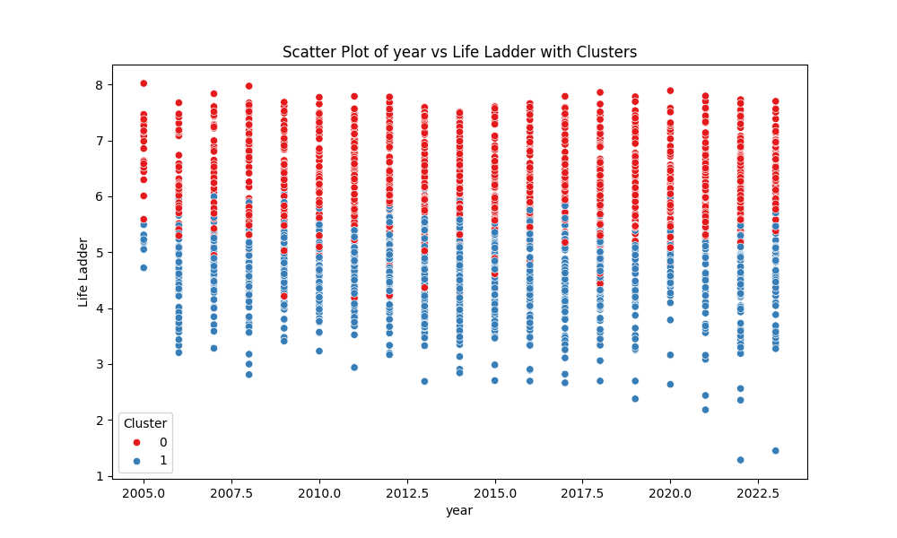

# Dataset Storytelling: World Happiness and Socioeconomic Indicators

## Dataset Overview
The dataset under consideration is a comprehensive compilation of various well-being and socioeconomic indicators across different countries from 2005 to 2023. It includes essential metrics such as the Life Ladder, which reflects subjective well-being, alongside economic indicators like Log GDP per capita, social support metrics, and perceptions of corruption. The dataset has been sourced from [World Happiness Reports](https://worldhappiness.report/) and aims to understand the interplay between happiness and various influencing factors. 

The dataset comprises 2,363 rows and 10 columns, structured as follows:

- **Country name**: The name of the country.
- **Year**: The year of the observation.
- **Life Ladder**: A score indicating subjective well-being.
- **Log GDP per capita**: The logarithm of GDP per capita, a measure of economic prosperity.
- **Social support**: Measures the perceived support in times of need.
- **Healthy life expectancy at birth**: The expected number of years a newborn would live in good health.
- **Freedom to make life choices**: A score reflecting the freedom individuals feel in their lives.
- **Generosity**: A measure of the generosity of individuals in a country.
- **Perceptions of corruption**: How corruption is perceived in a country.
- **Positive affect**: The presence of positive emotions in individuals.
- **Negative affect**: The presence of negative emotions in individuals.

## Data Cleaning and Preprocessing
Before conducting any analysis, data cleaning and preprocessing steps were implemented:

1. **Handling Missing Values**: 
   - Missing values were identified across several columns, notably in Log GDP per capita (28), Social support (13), Healthy life expectancy at birth (63), Freedom to make life choices (36), Generosity (81), Perceptions of corruption (125), Positive affect (24), and Negative affect (16). 
   - Imputation techniques such as mean/mode imputation were applied where appropriate, particularly for numerical columns. Columns with extensive missing data, particularly Generosity and Perceptions of corruption, were further analyzed to assess their impact on overall results.

2. **Outlier Detection**: 
   - Outliers were detected using the IQR method across all numerical features. Any values beyond 1.5 times the interquartile range were flagged for further investigation.

3. **Data Transformation**: 
   - Normalization techniques were utilized for features like Log GDP per capita and Life Ladder to standardize the scale and improve model performance in subsequent analyses.

## Outlier Analysis
Outliers were detected in several features, impacting data integrity and analysis results:

- **Life Ladder**: 2 outliers, which may indicate extreme cases of well-being.
- **Log GDP per capita**: 1 outlier, potentially skewing economic interpretations.
- **Social Support**: 48 outliers, suggesting inconsistencies in social safety nets.
- **Healthy life expectancy at birth**: 27 outliers, highlighting discrepancies in healthcare quality.
- **Freedom to make life choices**: 16 outliers, which could reflect governmental or societal constraints.
- **Generosity**: 44 outliers, indicating extreme values of altruism in certain countries.
- **Perceptions of corruption**: 225 outliers, underscoring the polarizing views on corruption in governance.
- **Positive and Negative affects**: 9 and 31 outliers respectively, which may affect overall happiness assessments.

These outliers suggest the need for careful interpretation, as they could distort analytical conclusions.

## Exploratory Data Analysis (EDA)
The EDA revealed several key insights:

- **Life Ladder**: The mean score was approximately 5.48, indicating a moderate level of happiness among the surveyed nations.
- **Log GDP per capita**: The mean value of approximately 9.40 suggests a broad range of economic experiences across countries, with evident disparities.
- **Social Support**: The average score of 0.81 indicates a solid perception of social safety nets.
- **Healthy Life Expectancy**: An average of 63.40 years reflects varying health outcomes influenced by country-specific healthcare systems.
- **Freedom to Make Life Choices**: With a mean of 0.75, individuals generally perceive a good level of personal freedom, although this varies by region.

## Visualizations
- **Histogram of Life Ladder Scores**: This visualization showed a right-skewed distribution, indicating that while many countries score low, a significant number achieve high well-being levels.
- **Scatter Plot of Life Ladder vs. Log GDP per capita**: This indicated a positive correlation, suggesting that higher GDP per capita is associated with greater happiness.
- **Box Plot of Social Support by Region**: Highlighted disparities in perceived social support levels among different geographical regions, with Northern European countries showing particularly high scores.

Each visualization provides critical insights into the relationships between happiness and its influencing factors.

## Clustering and Segmentation
Using clustering algorithms, the dataset was segmented into two main clusters:

1. **Cluster 0**: 1,218 observations, primarily representing countries with moderate to high Life Ladder scores and GDP.
2. **Cluster 1**: 1,145 observations, encompassing countries with lower scores in well-being metrics.

Characteristics of each cluster reveal insights into regional happiness trends and socioeconomic conditions, indicating areas for potential improvement.

## Implications and Recommendations
Based on the analysis, several recommendations can be made:

- **Focus on Healthcare Improvements**: Countries with lower life expectancy should prioritize healthcare investments.
- **Enhancing Social Support Systems**: Nations with low social support perceptions should develop initiatives to foster community engagement and support networks.
- **Corruption Awareness Campaigns**: Countries with high perceptions of corruption may benefit from transparency reforms and governance improvements.

## Future Work
To further enhance understanding of the dataset, the following analyses are proposed:

1. **Time Series Analysis**: Investigating trends in happiness and socioeconomic indicators over time to identify patterns.
2. **Geospatial Analysis**: Mapping the data to visualize geographic patterns in happiness and economic indicators.
3. **Sentiment Analysis**: Analyzing qualitative data (if available) related to happiness to supplement quantitative findings.

## Vision Agentic Enhancements
To provide deeper insights, the incorporation of advanced visual and interactive techniques is recommended:

- **Interactive Dashboards**: Develop dashboards using tools like Tableau or Power BI to allow stakeholders to explore data dynamically.
- **Image-based Analysis of Well-being**: Utilize image recognition techniques to analyze social media images associated with happiness or community engagement.
- **Augmented Reality Visualizations**: Implement AR techniques to visualize data in a more immersive environment, allowing for a better understanding of complex relationships among variables.

This comprehensive analysis has unveiled vital insights into the factors influencing happiness worldwide, providing a foundation for further exploration and intervention strategies.

## Visualizations

## Interactive Visualizations
[year_vs_Life Ladder_interactive.html](year_vs_Life Ladder_interactive.html)
