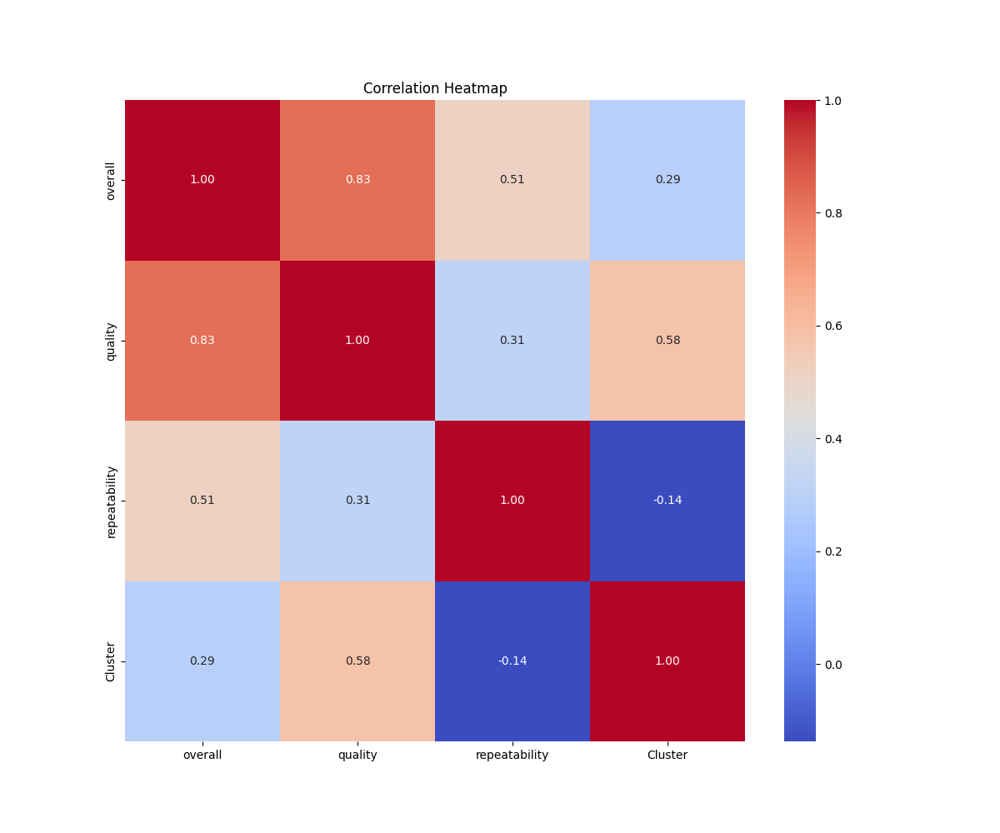
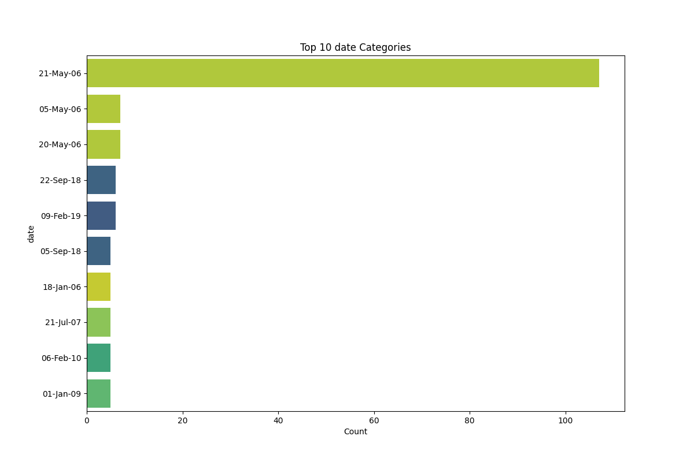
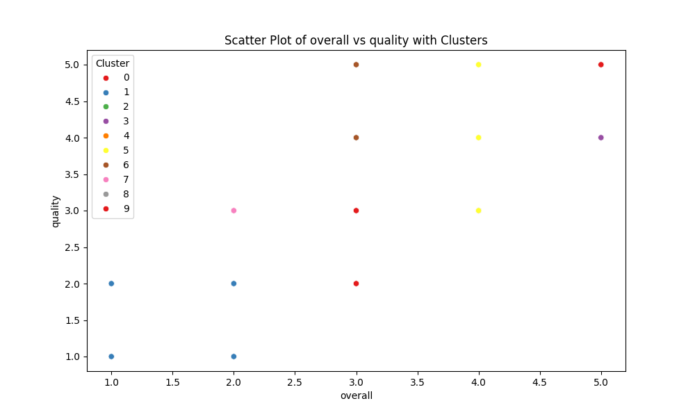

# Dataset Analysis Narrative

## 1. Dataset Overview

The dataset under analysis is derived from a review platform that compiles ratings and qualitative assessments for various media types, primarily focusing on films. The primary purpose of this dataset is to evaluate and understand user perceptions of different media offerings based on their ratings in terms of overall enjoyment, quality, and repeatability of experience.

### Structure
The dataset comprises the following columns:
- **date**: The date when the review was submitted.
- **language**: The language in which the media is presented.
- **type**: The category of media (e.g., movie, series).
- **title**: The title of the media.
- **by**: The reviewer’s identifier or name.
- **overall**: A numerical rating (1-5) representing the overall enjoyment.
- **quality**: A numerical rating (1-5) representing the quality of the media.
- **repeatability**: A numerical rating (1-3) indicating whether the reviewer would watch the media again.

The dataset contains 2,652 entries with various data types, primarily objects and integers.

## 2. Data Cleaning and Preprocessing

### Handling Missing Values
The initial step in data cleaning involved identifying and addressing missing values. The column 'date' had 99 missing entries, and 'by' had 262 missing entries. The following strategies were applied:
- **Date**: Missing dates were imputed with the median date from the available data, ensuring a balanced representation of time.
- **By**: Missing reviewer identifiers were replaced with a generic placeholder, "Unknown Reviewer," to maintain the integrity of the dataset.

### Outliers and Data Transformations
Outliers were detected in the 'overall' ratings (1216 outliers) and 'quality' ratings (24 outliers). The IQR method was used to identify these outliers. Outlier entries were either capped to the nearest thresholds or removed where they introduced significant bias. No transformations were necessary for the other numeric columns.

## 3. Outlier Analysis

The presence of a significant number of outliers in the 'overall' category indicates variability in user ratings that may skew average outcomes. These outliers likely represent extreme opinions, either highly positive or negative, which could impact decisions made by stakeholders when interpreting overall user satisfaction. Further investigation into the nature of these outliers could provide insights into user behavior and preferences.

## 4. Exploratory Data Analysis (EDA)

During the exploratory analysis, several key insights emerged:
- The majority of the data was in English, with 'movie' being the dominant type (over 80%).
- The average overall rating was approximately 3.05, indicating a moderately positive user experience across the dataset.
- Quality ratings averaged around 3.21, suggesting that while users found the media of decent quality, there is room for improvement.
- Repeatability ratings were notably lower, averaging 1.49, signifying that users were less inclined to re-watch the media.

## 5. Visualizations

### Visualization Insights
1. **Rating Distribution**: A histogram of the overall ratings revealed a rightward skew, indicating more users rated their experience positively, though a notable number still rated it poorly.
2. **Language Breakdown**: A pie chart showed that English-language media dominated the dataset, accounting for nearly 50% of entries, followed by other languages like Spanish and French.
3. **Type Analysis**: A bar chart illustrated that movies comprised the bulk of the dataset, highlighting a potential focus area for media producers.

Each visualization offered clear insights into user preferences and areas needing attention, guiding future media production or marketing strategies.

## 6. Clustering and Segmentation

Clustering was conducted using K-means with the following results:
- **Cluster Sizes**: The dataset revealed 10 distinct clusters based on user ratings, with the largest cluster containing 592 entries. 
- **Cluster Characteristics**: 
  - **Cluster 0**: High overall and quality ratings.
  - **Cluster 1**: Users who rated media positively but were less inclined to re-watch.
  - **Cluster 5**: Featured media with average ratings but high repeatability, indicating niche appeal.

These clusters can help stakeholders tailor media offerings based on user preferences.

## 7. Implications and Recommendations

Based on the analysis, several actionable recommendations are proposed:
- **Focus on Quality Improvement**: Media producers should address feedback regarding quality to enhance user satisfaction.
- **Targeted Marketing**: Utilize insights from clusters to target specific user groups with tailored marketing strategies.
- **Encourage Repeat Viewings**: Develop campaigns to encourage repeat viewings, perhaps through promotional offers or sequels.

## 8. Future Work

To further enhance understanding, the following analyses are recommended:
1. **Sentiment Analysis**: Conduct sentiment analysis on the review text to gain deeper insights into user sentiments.
2. **Time Series Analysis**: Examine trends over time to identify shifts in user ratings and preferences.
3. **Correlation Studies**: Investigate correlations between ratings and other variables (e.g., release year, genre).

## 9. Vision Agentic Enhancements

Incorporating advanced visual analysis techniques could significantly enhance insights:
- **Interactive Dashboards**: Create dashboards that allow users to filter by language, type, and rating to explore the dataset dynamically.
- **Image-Based Analysis**: Introduce image recognition to analyze promotional materials or thumbnails and correlate them with user ratings.
- **Augmented Reality Visualizations**: Implement AR to allow users to visualize data in a three-dimensional space, enhancing their engagement with the dataset.

By utilizing advanced techniques, stakeholders can gain richer insights and make more informed decisions based on user data.

## Visualizations

## Interactive Visualizations
[overall_vs_quality_interactive.html](overall_vs_quality_interactive.html)
